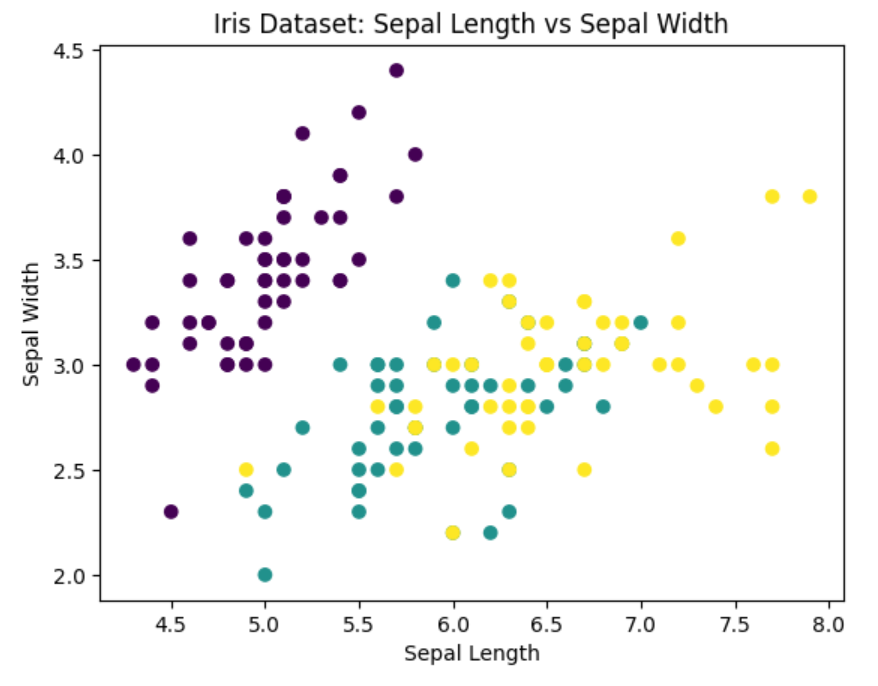
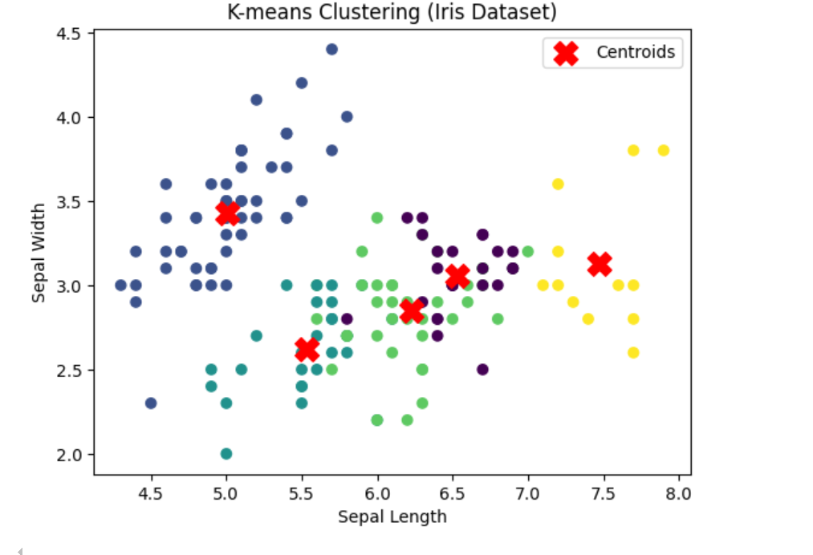
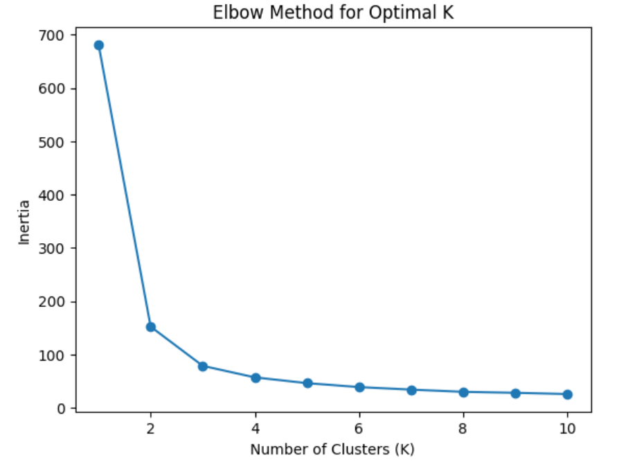
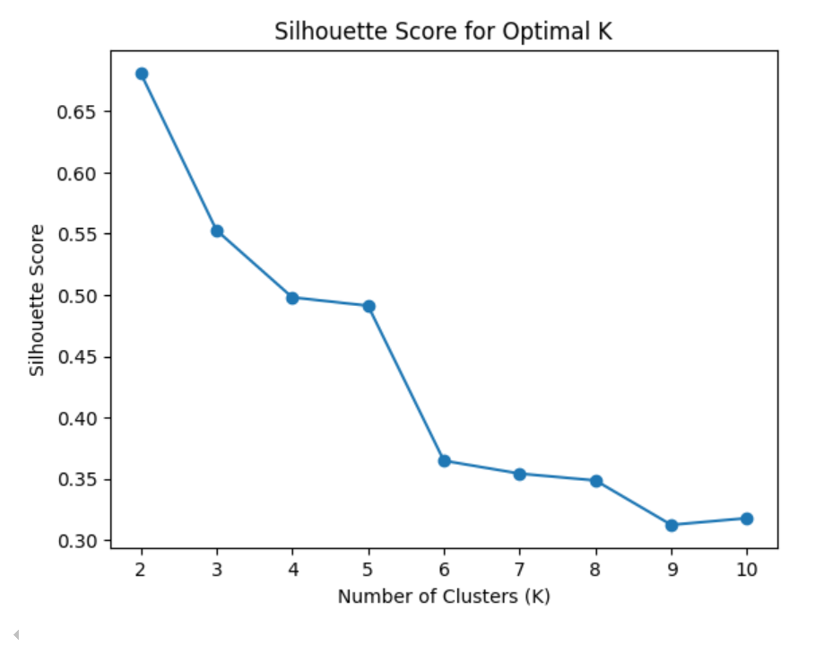

 

# Lab3: 聚类

## 实验要求

在.ipynb文件中编写python脚本，使用k-means，层次聚类、DBSCAN对数据集进行聚类，并进行可视化。

## 数据集

### make_blobs数据集 

### 导入 `make_blobs` 数据集的方法

```python
from sklearn.datasets import make_blobs

# 生成一个包含 4 个簇的数据集
X, y = make_blobs(n_samples=300, centers=4, cluster_std=0.60, random_state=0)

# X 是数据点的特征（每一行是一个数据点，每一列是一个特征）
# y 是数据点的真实标签，表示每个数据点属于哪个簇
```

- 参数说明：
  - `n_samples`: 生成数据的样本数量。
  - `centers`: 簇的数量，或者簇的中心坐标。
  - `cluster_std`: 每个簇的标准差，控制簇的分散程度。
  - `random_state`: 随机种子，用于确保每次运行生成相同的数据集。

### 导入`make_moons`数据集的方法

```python
from sklearn.datasets import make_moons


X, y = make_moons(n_samples=300, noise=0.1, random_state=0)

# X 是数据点的特征（每一行是一个数据点，每一列是一个特征）
# y 是数据点的真实标签，表示每个数据点属于哪个簇
```

- 参数说明：
  - `n_samples`: 生成数据的样本数量。
  - `noise`: 控制数据的噪声程度。噪声越大，数据点越可能不属于任何簇，或者误分类。
  - `random_state`: 随机种子，用于确保每次运行生成相同的数据集。

## 使用Scikit-Learn中的聚类方法

在 **Scikit-Learn** 库中，K-means、层次聚类和 DBSCAN 聚类都有对应的函数。下面是每种聚类算法的详细介绍及其对应的函数：

### 1. **K-means 聚类**

K-means 是一种经典的基于距离的聚类算法，适用于大多数结构化数据集。

- **函数**：`sklearn.cluster.KMeans`

#### 主要参数：

- `n_clusters`：要生成的簇的数量（K 值）。
- `random_state`：随机种子，确保结果可复现。
- `max_iter`：最大迭代次数。
- `init`：初始簇中心的选择方法（默认 `'k-means++'`）。

#### 示例代码：

```python
from sklearn.cluster import KMeans

# 使用 K-means 聚类
kmeans = KMeans(n_clusters=3, random_state=42)
kmeans.fit(X)

# 获取聚类标签和簇中心
labels = kmeans.labels_
centroids = kmeans.cluster_centers_
```

------

### 2. **层次聚类**

层次聚类是一种基于树状结构的聚类方法，可以生成一系列嵌套的簇。

- **函数**：`sklearn.cluster.AgglomerativeClustering`

#### 主要参数：

- `n_clusters`：最终聚类的簇数。
- `linkage`：链接方法，`'ward'`（默认）、`'complete'`、`'average'`、`'single'`。
- `affinity`：距离度量方式，常用 `'euclidean'`（欧氏距离）。

#### 示例代码：

```python
from sklearn.cluster import AgglomerativeClustering

# 使用层次聚类
hierarchical = AgglomerativeClustering(n_clusters=3, linkage='ward')
hierarchical.fit(X)

# 获取聚类标签
labels = hierarchical.labels_
```

------

### 3. **DBSCAN 聚类**

DBSCAN 是一种基于密度的聚类算法，适用于发现任意形状的簇，并能自动识别噪声点。

- **函数**：`sklearn.cluster.DBSCAN`

#### 主要参数：

- `eps`：两个样本之间的最大距离，用于判断它们是否属于同一簇。
- `min_samples`：一个簇内的最小样本数。
- `metric`：距离度量方式，默认 `'euclidean'`。

#### 示例代码：

```python
from sklearn.cluster import DBSCAN

# 使用 DBSCAN 聚类
dbscan = DBSCAN(eps=0.5, min_samples=5)
dbscan.fit(X)

# 获取聚类标签
labels = dbscan.labels_  # -1 表示噪声点
```

## 对金盏花数据集使用聚类算法实例：

### 步骤 1: 加载金盏花数据集

首先，我们需要导入金盏花数据集。`scikit-learn` 提供了一个经典的金盏花数据集（Iris dataset）。这个数据集包含了 150 个花朵样本，分别属于 3 个品种，每个样本包含 4 个特征：花萼长度、花萼宽度、花瓣长度和花瓣宽度。

```python
from sklearn.datasets import load_iris
iris = load_iris()
X = iris.data  # 特征数据
y = iris.target  # 标签数据
```

### 步骤 2: 可视化数据

在进行聚类之前，我们可以通过可视化来观察数据的分布和潜在的聚类结构。虽然金盏花数据集是高维的（4个特征），但我们可以选择两个特征来进行可视化。

```python
import matplotlib.pyplot as plt

# 可视化前两个特征
plt.scatter(X[:, 0], X[:, 1], c=y, cmap='viridis')
plt.xlabel('Sepal Length')
plt.ylabel('Sepal Width')
plt.title('Iris Dataset: Sepal Length vs Sepal Width')
plt.show()
```



### 步骤 3: 使用 K-means 聚类

接下来，我们可以使用 K-means 聚类算法来对数据进行分组。在金盏花数据集中，我们知道它有 3 个种类，因此我们选择 `n_clusters=3`。

```python
from sklearn.cluster import KMeans

# 创建 KMeans 模型
kmeans = KMeans(n_clusters=3, random_state=42)

# 使用 KMeans 聚类
kmeans.fit(X)

# 获取每个样本所属的簇标签
labels = kmeans.labels_

# 获取簇的中心
centroids = kmeans.cluster_centers_

# 输出簇的标签和中心
print("Cluster labels:\n", labels)
print("Cluster centers:\n", centroids)
```

### 步骤 4: 可视化聚类结果

我们可以将聚类结果可视化，看看 K-means 聚类是否能够将数据分成三个簇。以下是根据聚类标签进行着色的散点图。

```python
# 可视化聚类结果
plt.scatter(X[:, 0], X[:, 1], c=labels, cmap='viridis')
plt.scatter(centroids[:, 0], centroids[:, 1], c='red', marker='X', s=200, label='Centroids')
plt.xlabel('Sepal Length')
plt.ylabel('Sepal Width')
plt.title('K-means Clustering (Iris Dataset)')
plt.legend()
plt.show()
```



### 步骤 5: 聚类评估

K-means 聚类的结果可以通过不同的指标进行评估。常用的评估指标包括 **轮廓系数** (Silhouette Score)，它用来评估聚类的质量。

```python
from sklearn.metrics import silhouette_score

# 计算轮廓系数
score = silhouette_score(X, labels)
print(f"Silhouette Score: {score}")
```

轮廓系数的值在 [-1, 1] 之间，值越大，聚类效果越好。如果聚类效果不理想，可以考虑调整 `KMeans` 的参数或使用其他聚类算法。

### 步骤 6: 选择最佳的 K 值

在实际的聚类任务中，可能需要选择最佳的聚类数（`n_clusters`）。常用的做法是使用 **肘部法则** (Elbow Method) 或 **轮廓系数** 来评估最佳 K 值。

#### 肘部法则

肘部法则基于计算不同 K 值对应的总误差平方和（inertia），然后绘制 K 与误差平方和之间的关系图。图中出现拐点（即“肘部”）的位置通常表示最佳的 K 值。

```python
inertia = []
K_range = range(2, 11)  # K 从 2 到 10

for k in K_range:
    kmeans = KMeans(n_clusters=k, random_state=42)
    kmeans.fit(X)
    inertia.append(kmeans.inertia_)

# 绘制肘部法则图
plt.plot(K_range, inertia, marker='o')
plt.xlabel('Number of Clusters (K)')
plt.ylabel('Inertia')
plt.title('Elbow Method for Optimal K')
plt.show()
```



#### 轮廓系数

通过计算不同 K 值下的轮廓系数来评估最佳的聚类数。

```python
scores = []
for k in K_range:
    kmeans = KMeans(n_clusters=k, random_state=42)
    kmeans.fit(X)
    score = silhouette_score(X, kmeans.labels_)
    scores.append(score)

# 绘制轮廓系数图
plt.plot(K_range, scores, marker='o')
plt.xlabel('Number of Clusters (K)')
plt.ylabel('Silhouette Score')
plt.title('Silhouette Score for Optimal K')
plt.show()
```



### 步骤 7: 调整模型和参数

- **初始化方法** (`init`): 默认使用 `k-means++` 来初始化聚类中心，通常表现较好。如果数据集很大，可以设置 `init='random'` 来加速训练。
- **最大迭代次数** (`max_iter`): 默认为 300。可以通过增加此值来确保聚类收敛。
- **收敛标准** (`tol`): 设定收敛的阈值，确保算法在达到最小的改进时停止。

```python
kmeans = KMeans(n_clusters=3, init='k-means++', max_iter=300, tol=1e-4, random_state=42)
kmeans.fit(X)
```

### 步骤8：聚类结果可视化

当然，最后我们可以通过可视化将聚类结果展现出来。由于金盏花数据集有 4 个特征，但我们只选择了 2 个特征进行初步的可视化。接下来，我们使用 **主成分分析（PCA）** 来将高维数据降到 2D，方便我们进行可视化。

可视化步骤：

1. **使用 PCA 降维**：我们将数据降到二维，这样就可以在一个平面上绘制聚类结果。
2. **绘制散点图**：使用不同的颜色来标识不同的簇，并将聚类的中心标记出来。

```python
import matplotlib.pyplot as plt
from sklearn.decomposition import PCA

# 使用 PCA 将数据降维到二维
pca = PCA(n_components=2)
X_pca = pca.fit_transform(X)

# 可视化聚类结果
plt.figure(figsize=(8, 6))

# 绘制数据点，颜色代表聚类标签
plt.scatter(X_pca[:, 0], X_pca[:, 1], c=labels, cmap='viridis', label='Clusters')

# 绘制聚类中心
centroids_pca = pca.transform(centroids)  # 将聚类中心降到二维
plt.scatter(centroids_pca[:, 0], centroids_pca[:, 1], c='red', marker='X', s=200, label='Centroids')

# 设置标题和标签
plt.title('K-means Clustering (Iris Dataset) - PCA Visualization')
plt.xlabel('Principal Component 1')
plt.ylabel('Principal Component 2')
plt.legend()

# 显示图形
plt.show()
```


